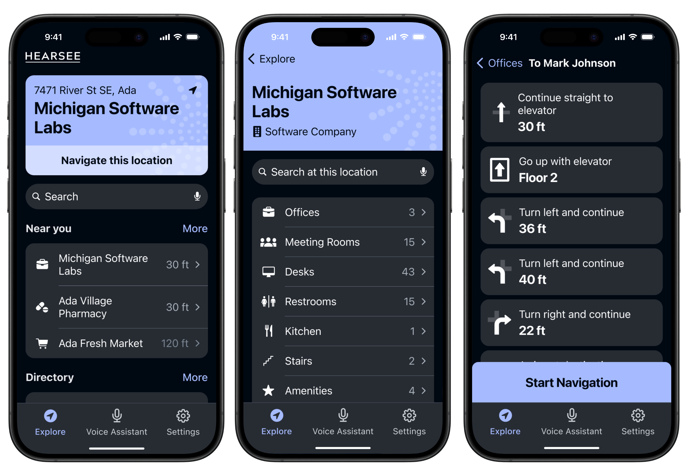

## Situation

Imagine a world where navigating indoor spaces is a daily struggle. For the six million Americans with vision loss, this is reality. Hearsee Mobility, a Utah-based nonprofit, set out to change this with an innovative indoor navigation system. While they had made progress on mobile applications, their crucial web application had stalled, threatening to derail the entire project.

Due to a confidentiality agreement, I can only share a limited amount of information about this project. However, I can provide some details from the first release that highlight the challenges and impact of our work.
## What is the Hearsee Mobility platform?
Hearsee  mobility tech platform designed to help blind and visually impaired (BVI) people navigate indoor spaces more effectively. Utilizing RFID technology, it integrates specialized hardware within the handles of white canes, RFID tags placed throughout buildings, and a mobile app for seamless indoor navigation. As users walk by RFID tags, the cane's hardware reads the information and communicates it to the mobile app, which also acts as a navigation device to help users find their destination. A web application allows building managers to upload floor plans, place tags, and create routes for enhanced accessibility. Hearsee offers an affordable solution to bridge the gap between basic ADA requirements and true navigability for BVI individuals.
### Web App:

- Used to upload building floor plans.
- Allows placement of RFID tags on the floor plan.
- Enables users to create navigable routes.
- Routes are uploaded to the cloud and accessible to the mobile app.
### Mobile App:

- Connects with the white cane hardware via Bluetooth.
- Receives information from RFID tags to assist in navigation.
- Provides navigation guidance to users within the building.
- Allows users to search for specific destinations in a building.

## Task

I was brought in to take charge of the web application's product design, UX design, and overall design strategy. My role was critical: to breathe new life into a stagnant project and create a web application that would seamlessly integrate with the existing mobile solutions.

## Action

To tackle these challenges head-on, I implemented a series of strategic measures:

### Design Re-evaluation and Alignment 
When I joined the project, I found that the existing designs were creating limitations for our development team. To address this:
- I initiated a comprehensive review of the current web application design.
- I worked closely with the development team to understand their constraints and requirements.
- Together, we realigned the UX design with technical feasibility, ensuring that our designs provided the necessary flexibility for implementation.
- This process involved numerous collaborative sessions where we dissected each design decision and its implications for development.
### Feature Integration and Conceptualization
Many potential features were still in the conceptual stage, untouched by design or development. When discussed, these elements often clashed with existing designs. To resolve this:
- I organized cross-functional workshops bringing together design, development, and product teams.
- We conceptualized these features together, ensuring they were both technically feasible and aligned with our overall design strategy.
- This collaborative approach helped us avoid potential conflicts down the line and created a shared vision for the product.
### Enhanced Communication and Collaboration
I noticed that there was significant friction between the design and development teams, hampering productive discussions. To address this, I implemented several communication-enhancing strategies:
- Regular sync-up meetings where team members could openly discuss challenges and ideas
- "Design-Dev Pair" sessions where designers and developers worked side-by-side on specific features
- A feedback system that encouraged constructive criticism and idea sharing between teamsThese measures helped break down silos, foster a culture of open communication, and align everyone towards our common goals. As a result, we saw a marked improvement in team morale and productivity.
### User-Centric Approach
Understanding the diverse needs of the blind and low vision community was crucial to our design process. We conducted extensive user research, including:

- In-depth interviews with individuals across the spectrum of visual impairment and facility management.
- Shadowing sessions to observe how users navigate unfamiliar spaces
- Usability testing with early prototypes

## Results

Our renewed approach and collaborative effort yielded impressive outcomes:

- We completed the web application development within the projected timeline, aligning it seamlessly with the existing mobile solutions.
- The redesigned web interface reduced building mapping time by 300%, a crucial improvement for facility managers.
- 98% of users reported that the integrated system (mobile apps + web portal) significantly improved their navigation experience.
- We created a flexible, scalable design that could easily adapt to changing building needs and future feature additions. Most importantly, we transformed a stalled project into a dynamic, user-friendly system that's set to revolutionize indoor navigation for the visually impaired. As James Bloomfield, CEO of Hearsee Mobility, noted:

> "This technology isn't just about navigation—it's about independence and opening up a world of possibilities for millions."

The Hearsee web application, working in tandem with the mobile apps and RFID-scanning cane, has created a comprehensive ecosystem for indoor navigation. It's not just about finding a specific location; it's about providing a sense of freedom that many take for granted.

Looking ahead, the potential for Hearsee-enabled buildings continues to grow. With our flexible, user-centric design, we've laid the groundwork for a future where visual impairment no longer limits one's ability to confidently navigate any indoor space. As a UX designer, being part of this transformative project has been both challenging and deeply rewarding, reminding me of the power of thoughtful, inclusive design to change lives.
