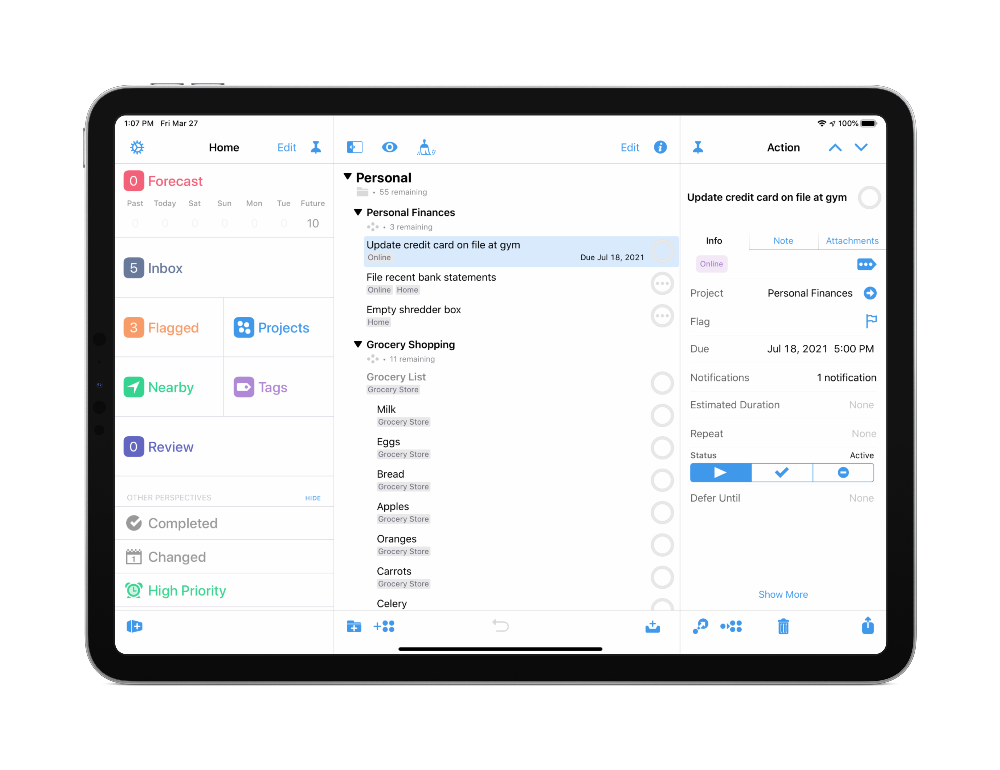
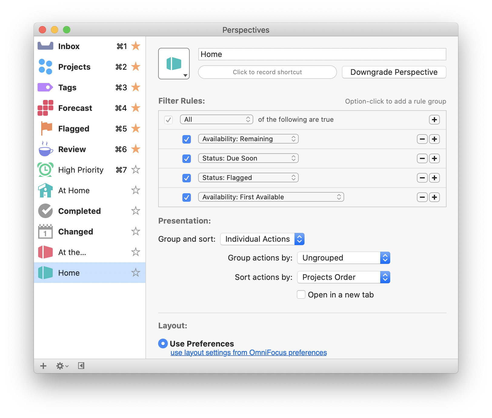
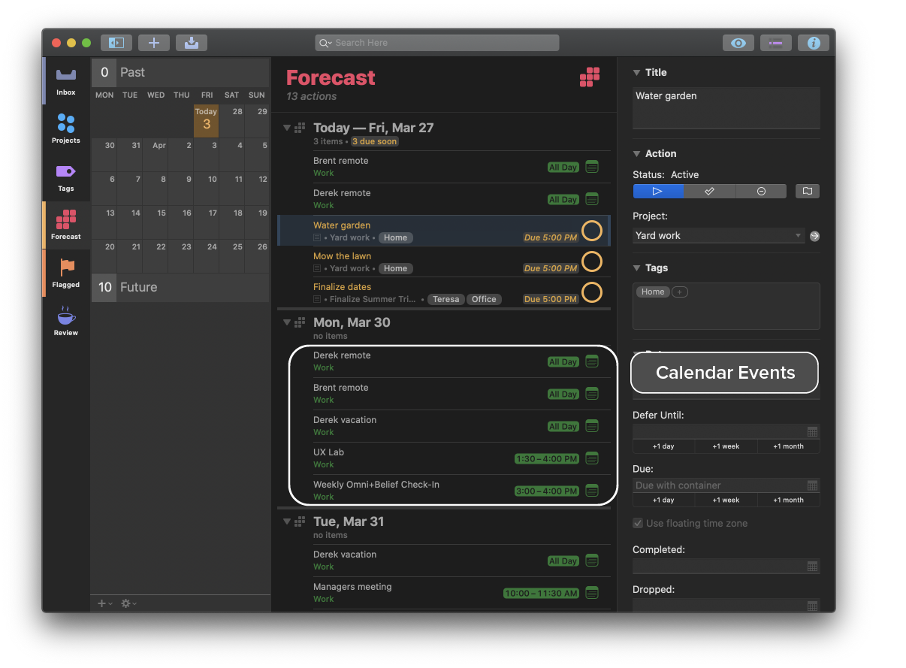
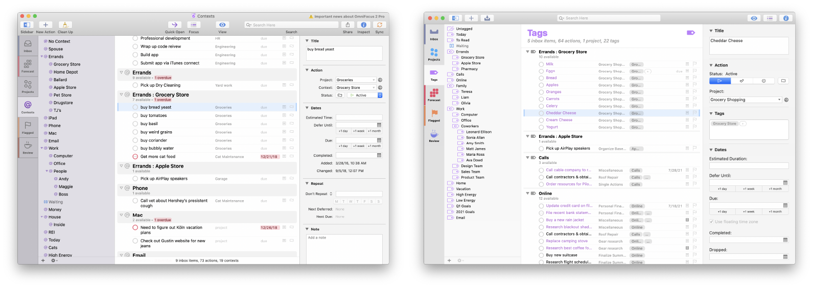

## Introduction
OmniFocus, a leading task management app, required a major update to address evolving user needs and maintain its competitive edge. As a key contributor to version 3, I worked closely with the CEO and product manager to define the scope of the release. 

Our goal was to enhance the product based on user feedback—such as the need for more flexible tagging and improved calendar integration—and to ensure an enhanced user experience across Mac and iOS platforms. We gathered user insights through interviews, surveys, and usability testing, ensuring our design addressed real user needs and pain points.

## Objectives and Responsibilities
My responsibilities were key to the project's success, including:
**Team Leadership & Strategy**
- Leading the user experience team in redesigning the application
- Developing design strategy and overseeing operations
- Managing a team of five designers and researchers
**Research & Creative Direction**
- Crafting and directing research initiatives
- Providing UX/UI creative direction
**Collaboration & Quality Assurance**
- Working with QA and Support to coordinate user feedback and bug reports
## Key Areas for Improvement
Based on user feedback and analytics, we identified four key areas for improvement:
1. Replacing contexts with tags (Mac and iOS)
2. Enhancing custom perspectives (Mac and iOS)
3. Improving calendar visualization in the Forecast perspective (Mac and iOS)
4. Introducing customizable inspectors (iOS only)
## Research Methodology
To inform our design decisions, we used a variety of research methods:
- **User Interviews**: Conducted in-depth interviews with existing users to understand workflows, pain points, and feature preferences.
- **Surveys**: Collected quantitative data on feature requests and satisfaction levels from a broader user base.
- **Usability Testing**: Tested prototypes to gather feedback on new features and identify areas for improvement.
- **Analytics Review**: Analyzed in-app usage data to identify common usage patterns and pain points.
This comprehensive approach ensured that our enhancements were driven by real user data, leading to a more impactful, user-centered product.
## Challenges and Solutions
Throughout development, we faced several key challenges:
- **Complexity of Replacing Contexts with Tags**: Transitioning from "contexts" to "tags" was more complex than anticipated. We conducted extensive usability testing to ensure the new tagging system provided flexibility without overwhelming users.
- **Balancing Power User Needs with General Usability**: Enhancing custom perspectives for power users while maintaining usability was challenging. We leveraged the macOS predicate editor framework to provide a powerful yet accessible interface, gathering feedback from both power users and general users to strike the right balance.
- **Calendar Integration Complexity**: Integrating calendar events into the Forecast perspective required careful consideration to avoid visual clutter. We used users' calendar app colors to differentiate events, reducing friction and enhancing clarity.
- **Reducing Cognitive Load in Inspectors**: The default inspector view had too many options, creating cognitive overload. We designed customizable inspectors that allowed users to rearrange, hide, and prioritize options, validated through iterative testing.
## Design Actions
### Replacing Contexts with Tags
 
- Created tag iconography for consistent branding
- Used capsule shapes for tags in the outline view for readability
- Managed tag clutter with an ellipsis/more tag system

### Enhancing Custom Perspectives

- Enhanced the perspective filter engine with the macOS predicate editor framework, allowing power users to create advanced filtering rules and customize workflows.

### Improving Calendar Visualization

- Integrated calendar events into the Forecast perspective, using users' calendar app colors for differentiation, allowing easy association between meetings and tasks.
### Customizable Inspectors (iOS)

- Designed customizable inspectors to allow users to personalize their experience, reducing cognitive load and enhancing usability.
## User-Centered Metrics and Tracking
To evaluate the effectiveness of our design improvements, we tracked several key user-centered metrics:
- **Task Completion Rate**: The new tagging system led to a 15% increase in task completion, indicating improved categorization and task management.
- **User Satisfaction Scores**: Satisfaction scores increased by 12% post-launch, reflecting positive responses to features like customizable inspectors and calendar integration.
- **Feature Adoption Metrics**: Customizable inspectors saw a 46% uptake within the first month, demonstrating users valued personalization.
- **Support Tickets and Feedback**: The number of tickets related to confusion around contexts dropped significantly, indicating a clearer, more intuitive user experience.
## Results and Key Takeaways

OmniFocus 3 launched to overwhelmingly positive feedback:
- **User Adoption**: Daily active users increased by 12% on Mac and 17% on iOS, compared to a 5% growth rate for the previous version. OmniFocus 3 for iOS remained a top-25 grossing app for six weeks in the App Store, while the Mac version held a top-25 position for four weeks, doubling the duration of the prior version.
- **Media Reception**: Rosemary Orchard from MacStories praised the release, saying:

> "This release represents a substantial upgrade that has brought more control to my system and will keep me, and many others, committed OmniFocus users far into the future."

The success of OmniFocus 3 highlighted our team's ability to understand user needs, implement complex features, and deliver a significantly improved product, solidifying OmniFocus's position as a leading task management solution. A key lesson learned was the importance of incorporating user feedback early in the design process, helping prioritize impactful features and fostering close collaboration between design, development, and support teams to ensure a seamless user experience.