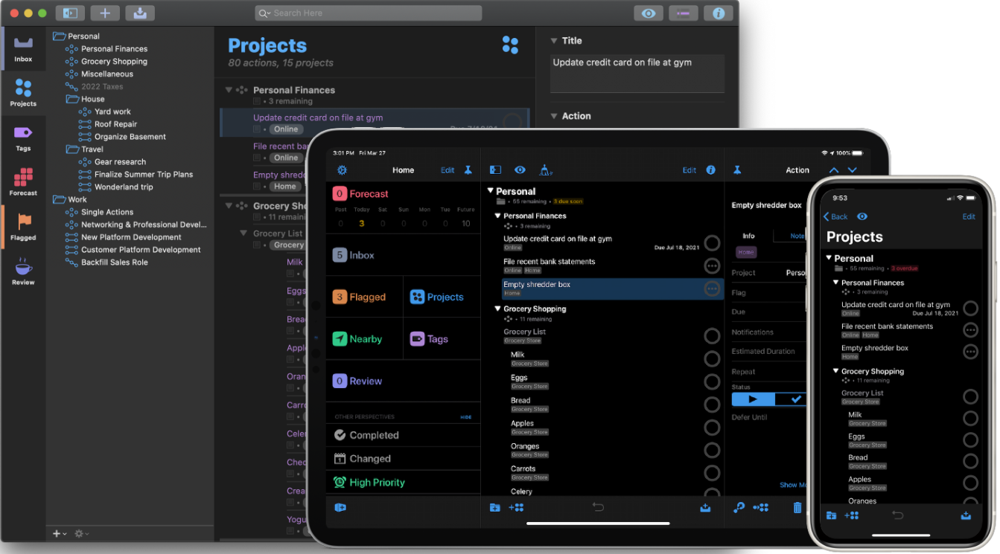
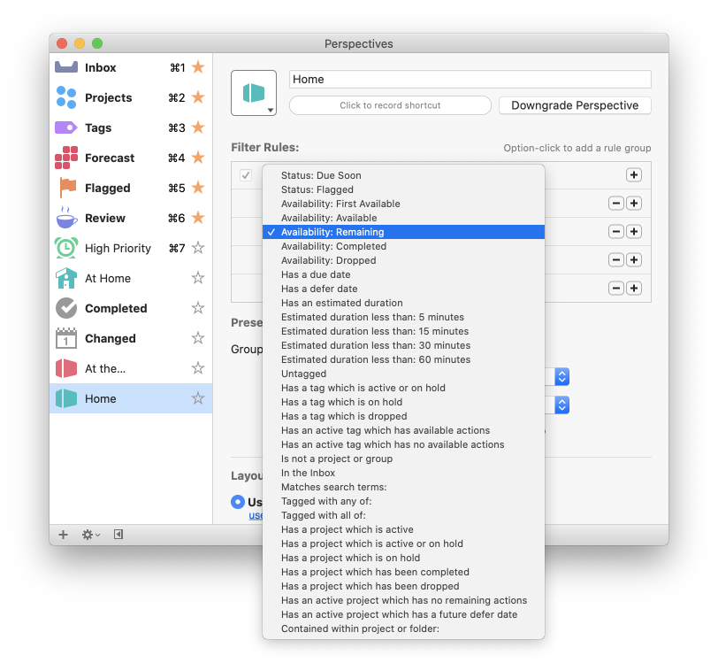
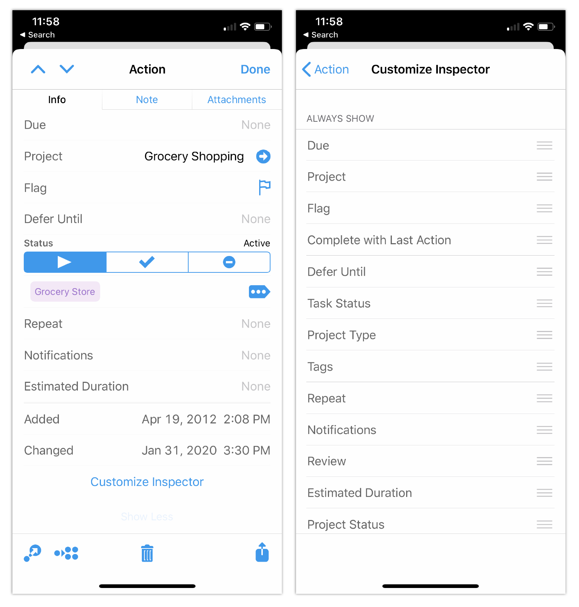

## Situation
OmniFocus, a popular task management application, was due for a major update. As a key player in the development of version 3, I worked closely with the CEO and product manager to determine the scope of this new release. Our goal was to address user feedback, enhance functionality, and improve the overall user experience across both Mac, iPad OS, and iOS platforms.

---
## Task
**My primary responsibilities included:**
1. Leading the user experience team in a complete redesign of the application
2. Crafting and directing research initiatives
3. Developing design strategy and overseeing design operations
4. Providing UX/UI creative direction
5. Managing a team of 5 UX designers, UI designers, and researchers
6. Collaborating with QA and Support managers to coordinate bug reports and user feedback

**We identified four key areas for improvement:**
1. Replacing contexts with tags (Mac and iOS)
2. Enhancing the power of perspectives (Mac and iOS)
3. Improving calendar visualization in the Forecast perspective (Mac and iOS)
4. Making inspectors customizable (iOS only)

---
## Action
### Replacing Contexts with Tags
This seemingly straightforward task proved to be more complex than initially anticipated. We had to consider:
- Terminology: We decided to change "contexts" to "tags" based on user familiarity and ease of understanding.
- Visualization: We created a stylized tag iconography for the perspectives and left sidebar to brand the feature. In the outline view, we opted for a simple capsule shape to maintain readability.
- Space management: We implemented an ellipsis/more tag system to handle multiple tags without cluttering the outline view.
### Enhancing Custom Perspectives

To cater to our power users, we developed a more dynamic perspective filter engine. We leveraged the macOS predicate editor framework to create an interface allowing users to build complex "if that, then this" scenarios. This significantly expanded the filtering options available to users.
### Improving Calendar Visualization
We integrated calendar events directly into the Forecast perspective's outline view, interleaving them with action items. To differentiate between the two, we applied the user's calendar app color to a calendar icon for events. This integration reduced friction and improved users' ability to associate actions with events.
### Customizable Inspectors (iOS)

To address the cognitive load issue in the inspector view, we designed a customizable experience. Users can now rearrange, hide, and easily access inspector options according to their preferences, minimizing distractions and improving usability.

---
## Result
The launch of OmniFocus 3 was met with overwhelmingly positive feedback from users and media alike:
1. User adoption:
   - Daily active users increased by 12% on Mac and 17% on iOS
   - OmniFocus 3 for iOS spent six weeks as a top-25 grossing app in the App Store
   - OmniFocus 3 for Mac spent four weeks as a top-25 grossing app in the App Store
2. Media reception:
   Rosemary Orchard from MacStories praised the release, stating: "This release represents a substantial upgrade that has brought more control to my system and will keep me, and many others, committed OmniFocus users far into the future."
   
---
## Conclusion
The success of OmniFocus 3 demonstrated our team's ability to understand user needs, implement complex features, and deliver a product that significantly improved upon its predecessor. The project not only met but exceeded our goals, solidifying OmniFocus's position as a leading task management solution.