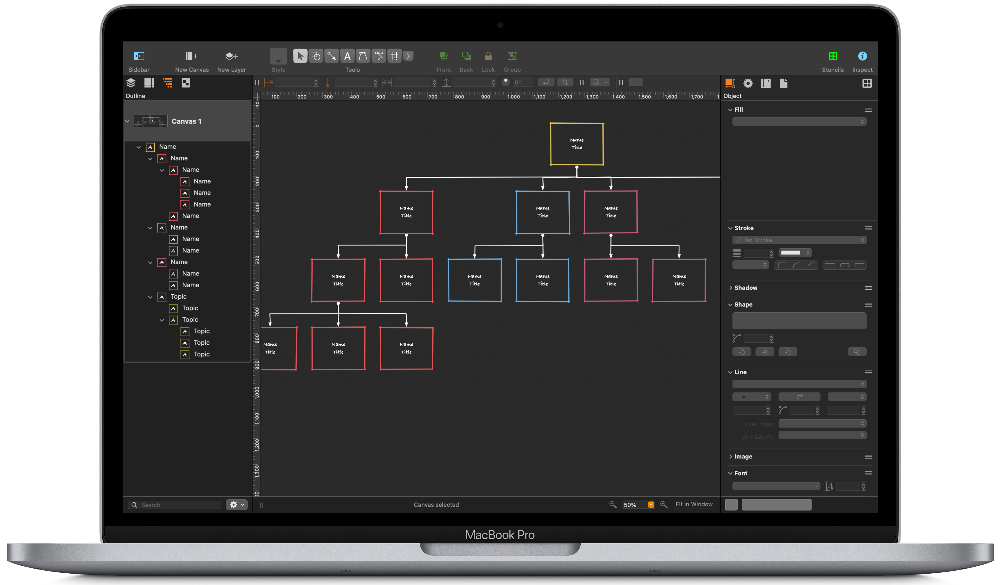
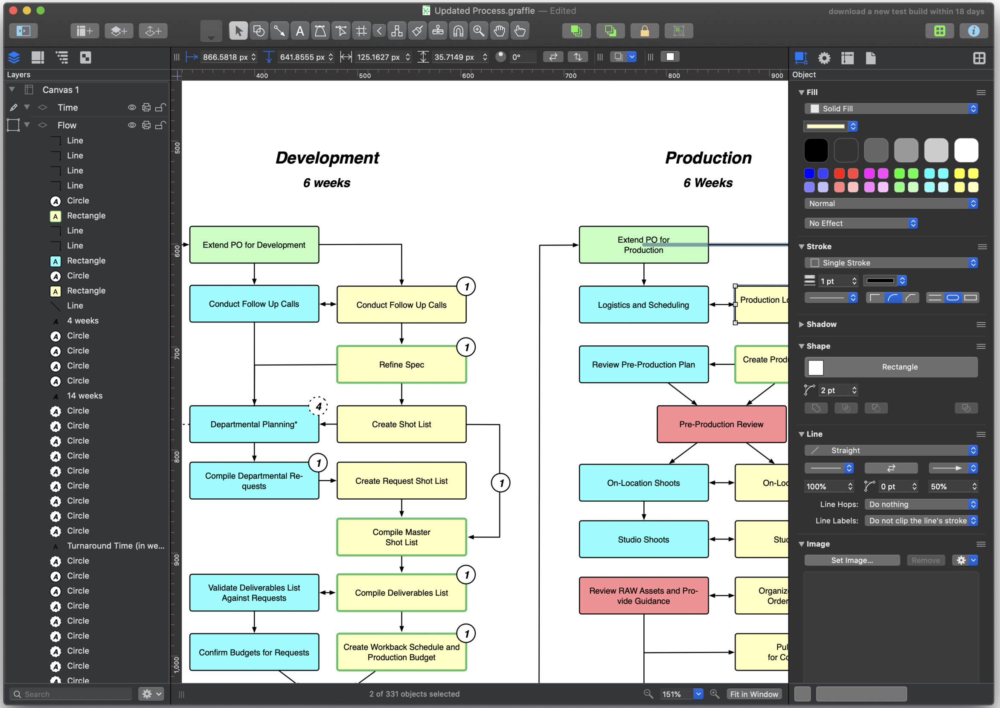
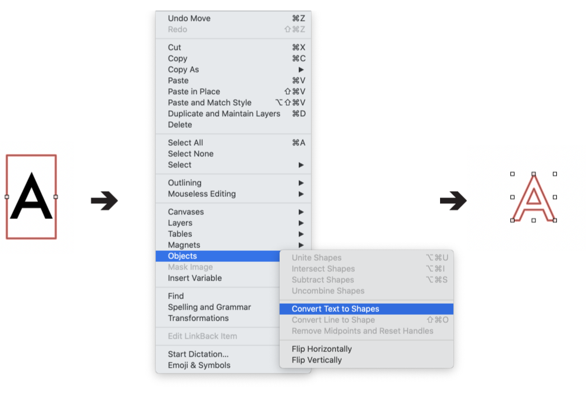

## Situation
OmniGraffle is a vector-based diagramming and illustration tool for macOS and iOS. As the creative director for the end-to-end redesign of OmniGraffle, I managed research, design operations, and a talented team of UX designers, UI designers, and researchers. This effort led to a 23% increase in download-to-trial conversion rates and positioned OmniGraffle 7 as a top-10 grossing app on the App Store for seven weeks.
## Task

The focus of the version 7 redesign was to enhance the efficiency and usability of OmniGraffle for creative professionals. Our primary goal was to streamline workflows and make key features more accessible, reducing complexity, improving design efficiency, and enhancing usability. The release of OmniGraffle 7.0 introduced several significant improvements:
- **Artboards**: Helped users manage complex projects more effectively.
- **Bezier Point Editing Tool Enhancements**: Simplified vector manipulation.
- **Convert Lines and Text to Shapes**: Offered greater design flexibility.
- **Keyboard Shortcuts**: Sped up navigation and tool access.
- **New Onboarding Experience**: Improved the initial user experience and conversion rates.
## Research and Analysis
For the OmniGraffle 7.0 release, I led the UX team in research to identify user needs and pain points.
### Research Methods
We employed a mix of qualitative and quantitative research methods to guide the redesign:
- **User Interviews**: Conducted in-depth interviews to gather insights into how users interacted with the product and identify specific frustrations.
- **Usability Testing**: Carried out usability tests to observe real user behavior, uncovering key pain points and validating our assumptions.
#### User Interviews (Pre-Development Phase)
- **Objective**: Understand user needs, motivations, and challenges before OmniGraffle 7 development.
- **Participants**: 15 users experienced with OmniGraffle 6.
- **Method**: In-depth interviews with open-ended questions.
#### Key Insights:
**Feature Requests**:
    - **60%** requested better beizer point editing.
    - Example: Creating custom vector shapes.
**Pain Points**:
    - **50%** found the lack of artboards in OmniGraffle 6 a deal breaker.
    - Issues with finding essential features.
**Goals and Expectations**:
    - **70%** emphasized the need to work more quickly.
    - Focused on improving productivity and reducing unnecessary steps.
#### Usability Testing (Pre-Development Phase)
- **Objective**: Identify areas for improvement in OmniGraffle 6.
- **Participants**: 10 users with representative use cases.
#### Measured Metrics:
**Task Success Rate**:
    - **65%** of participants completed key tasks successfully.
    - Insight: Need for significant redesign in some workflows and add new features.
**Time on Task**:
    - Average time: **4.2 minutes** for key workflows.
    - **55%** of users felt this was too long, indicating the need for efficiency improvements.
### Research Findings
The research provided valuable insights into the most-requested features and user frustrations:
- **Artboards**: Users needed a better way to organize and manage complex projects.
- **Bezier Point Editing Tool Improvements**: Users wanted an easier way to add or remove vector points without switching tools.
- **Convert Lines and Text to Shapes**: Many users requested the ability to convert strokes and text into editable shapes.
- **Keyboard Shortcuts**: Users expressed the need for faster navigation and tool access.
- **Improved Onboarding**: Analytics and user feedback indicated that users struggled with the initial setup, leading to a revamped onboarding process.
## Collaboration with Engineering
We collaborated closely with Omni's engineering team to ensure the proposed solutions were feasible and effectively addressed both user needs and technical constraints.
- **Artboards Implementation**: Developing the Artboards feature presented a significant challenge due to technical limitations with handling layers in the existing drawing model. By working alongside engineering, we developed a solution that treated artboards like layers while maintaining system performance, resulting in a smooth user experience.
## Key Improvements
### 1. Artboards

We introduced an innovative artboard feature that treated artboards like layers, offering users increased flexibility and efficiency. For example, one of our users, a graphic designer working on a complex website layout, found that artboards significantly streamlined her workflow. She could easily organize different sections of the site within individual artboards, export them at required resolutions, and manage her project more effectively without losing track of components. Here's how it works:

### 2. Bezier Point Editing Tool

We simplified the process of adding or removing vector points, allowing users to do so without switching tools. This enhancement provided a faster and more fluid editing experience. Users reported being able to make precise adjustments more efficiently, significantly reducing the time spent on vector manipulation and contributing to a smoother workflow.
### 3. Convert Lines and Text to Shapes

Responding to user requests, we added the ability to convert strokes and text into shapes while preserving aesthetics with minimal vector points. This functionality was seamlessly integrated into the existing menu for easy access.
### 4. Keyboard Shortcuts

To improve ease of use, we relocated keyboard shortcuts to a modal window accessible via the OmniGraffle menu. Tools and menus were clearly listed, and single-key functionality was introduced. We also added warning icons for conflicting shortcuts, enhancing navigation efficiency.
### 5. New Onboarding Experience

Based on analytics and user feedback, we revamped the first-run onboarding experience. We added a short introductory video showcasing key features, a "What's New" section for updates, and a comprehensive walkthrough of the interface. These changes led to significant increases in download-to-trial conversion rates: 23% on the App Store and 16% on our website.
## Challenges and Solutions
During the redesign process, we faced several challenges requiring creative problem-solving and cross-functional collaboration:
### Technical Limitations with Artboards
The existing drawing model did not natively support treating artboards like layers. Collaborating closely with the engineering team, we developed a solution that maintained system performance while adding the desired functionality. This process strengthened our understanding of the technical framework and ensured that the final solution met user needs
### User Confusion During Onboarding
Analytics and user feedback indicated confusion during the initial onboarding experience in the previous version, resulting in low conversion rates from download to trial. We redesigned the onboarding flow, incorporating an introductory video, a "What's New" section, and a guided walkthrough of key features. This improved conversion rates significantly.
### Balancing Feature Complexity and Usability
Introducing new features such as the Bezier Point Editing Tool enhancements and Convert Lines to Shapes required careful consideration to avoid overwhelming users. Through iterative usability testing, we struck a balance that ensured these features were powerful yet easy to use.
## Result
To measure the impact of our redesign efforts, we compared key metrics before and after the release of OmniGraffle 7.0:
### Download-to-Trial Conversion Rate
Before the redesign, the conversion rate was 12% from the Mac App Store and 18% from our website. After implementing the new onboarding experience, these rates increased to 35% from the Mac App Store (a 23% improvement) and 34% from our website (a 16% improvement).
### Sales Growth
In the three months following the release of OmniGraffle 7, sales increased by 33% compared to the same period for OmniGraffle 6, making OmniGraffle 7 for Mac the second most successful release in the application's history.
### User Efficiency
User testing revealed a 12% reduction in the time taken to complete common workflows, such as project organization and vector manipulation, due to improvements like Artboards and Bezier Point Editing Tool enhancements.
For three months following the release, sales increased by 18% compared to OmniGraffle 6 during the same period. It remained a top-10 grossing app on the App Store for seven weeks. In the three years since its release, OmniGraffle 7 Pro has consistently been Omni's top-grossing product on both the Omni store and the Mac App Store.
## Conclusion
Implementing the artboard feature was more challenging than anticipated, but the experience ultimately strengthened our team's understanding of the drawing model and enhanced cross-functional collaboration. This project underscored the importance of deeply understanding the technical aspects of the product and highlighted the value of perseverance in overcoming obstacles. Despite my design expertise, I learned not to assume shared knowledge between design and development teams. Using simple explanations and visual aids, I effectively conveyed the importance of artboards, underscoring the value of cross-team communication and education in successful product development.