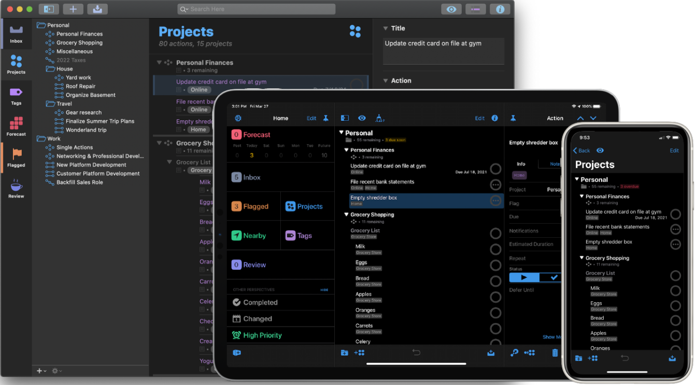
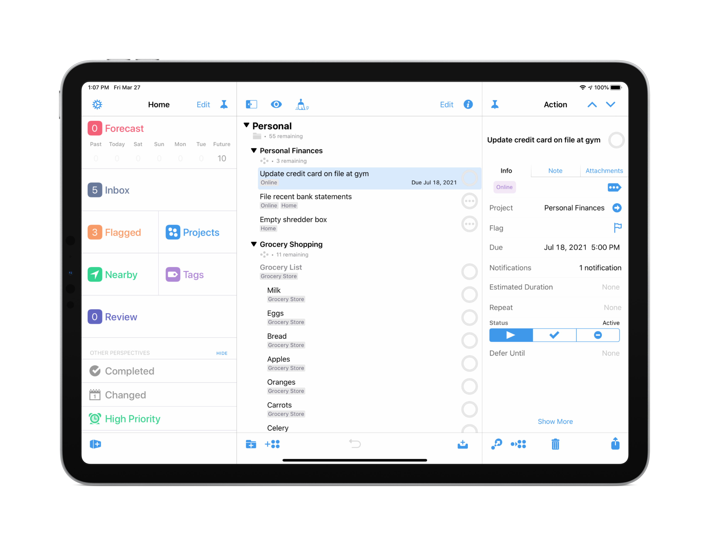
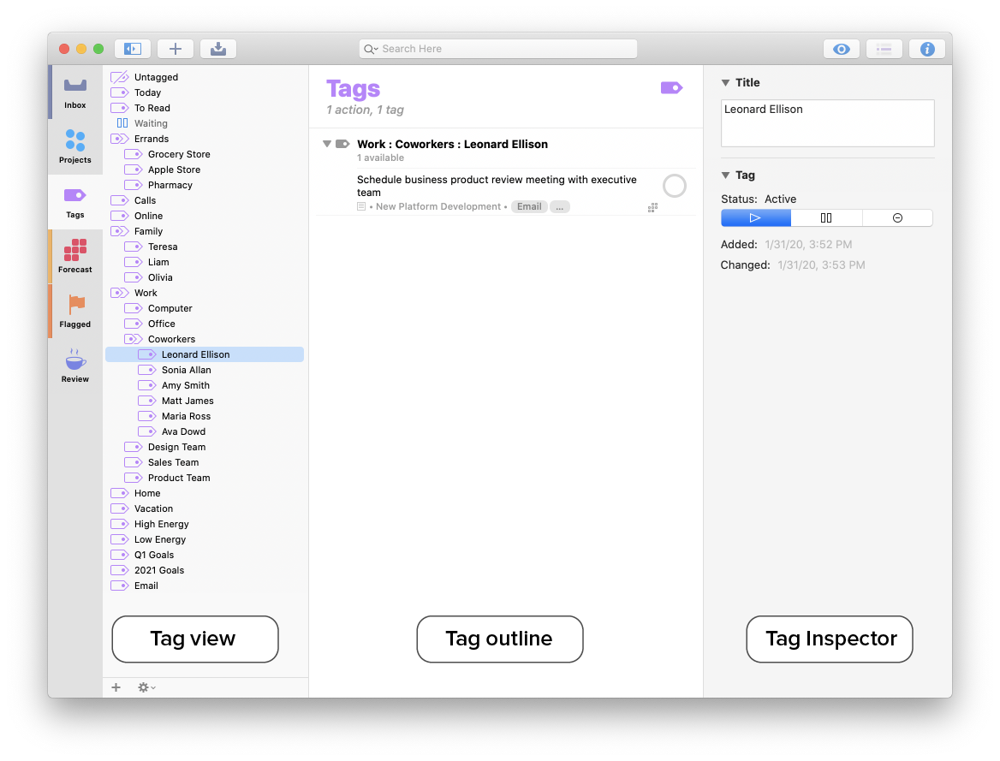
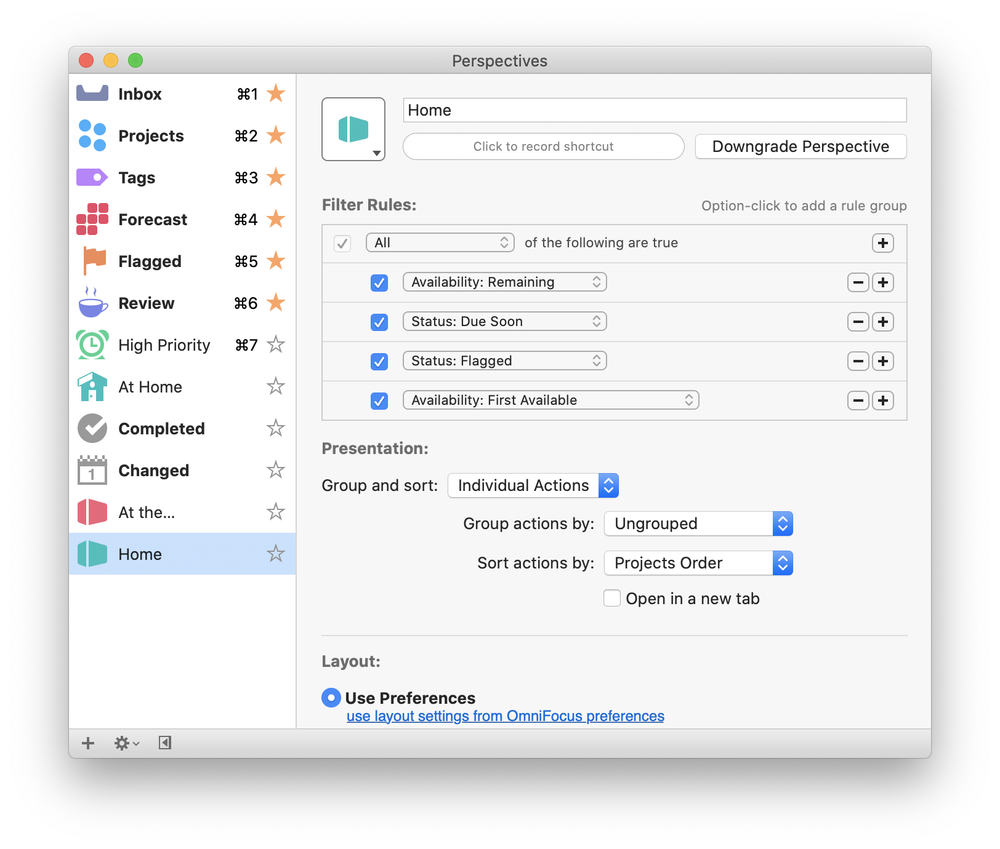
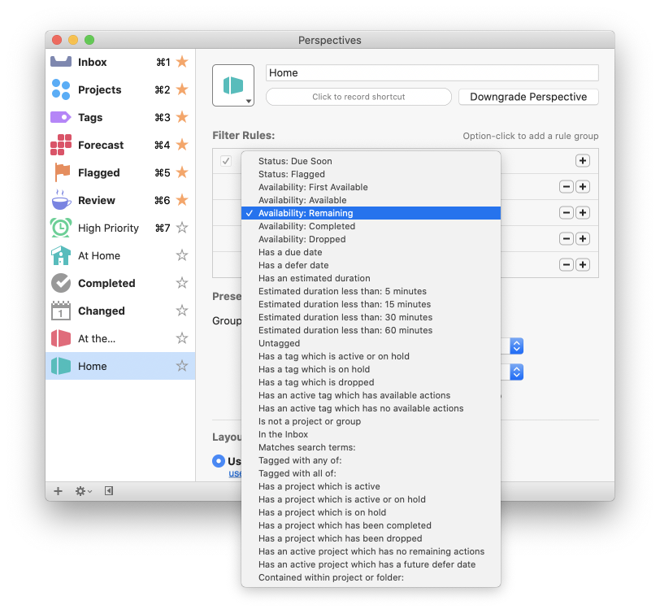
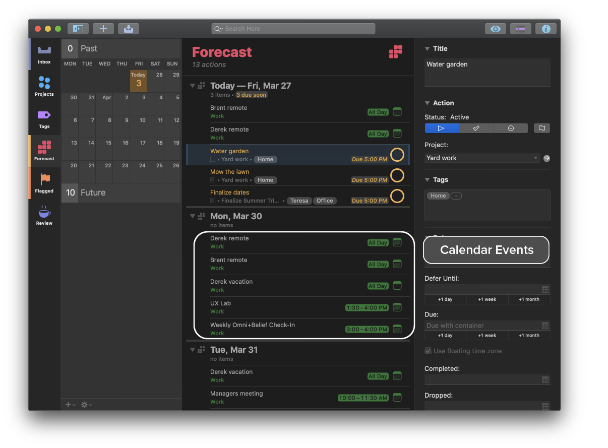
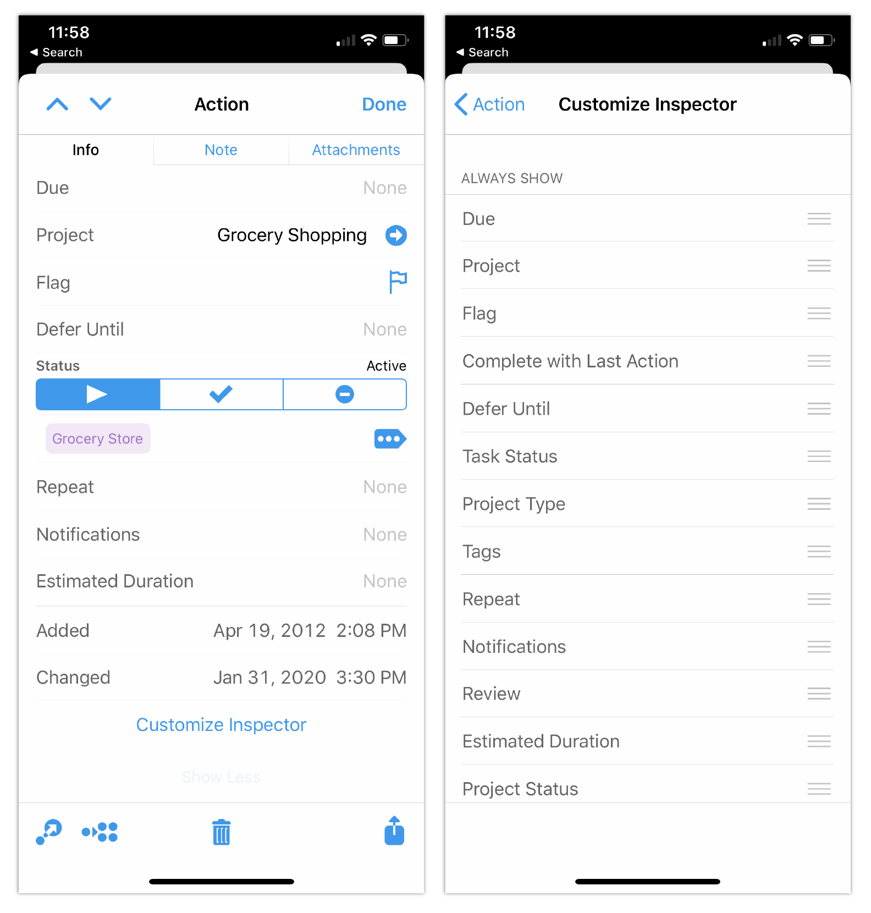
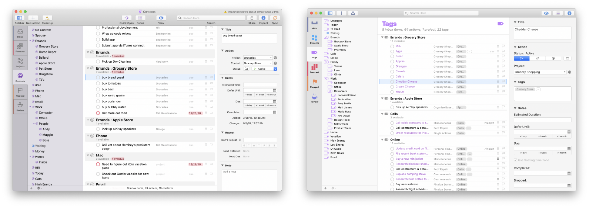

## Introduction
OmniFocus, a leading task management app, required a major update to address evolving user needs and maintain its competitive edge. As a key contributor to version 3, I worked closely with the CEO and product manager to define the scope of the release. 

Our goal was to enhance the product based on user feedback—such as the need for more flexible tagging and improved calendar integration—and to ensure an enhanced user experience across Mac and iOS platforms. We gathered user insights through interviews, surveys, and usability testing, ensuring our design addressed real user needs and pain points.

<figure>
  

<figcaption>OmniFocus 3 for iOS.</figcaption>
</figure>

## Objectives and Responsibilities

My responsibilities were key to the project's success, including:

**Team Leadership & Strategy**
- Leading the user experience team in redesigning the application
- Developing design strategy and overseeing operations
- Managing a team of five designers and researchers

**Research & Creative Direction**
- Crafting and directing research initiatives
- Providing UX/UI creative direction

**Collaboration & Quality Assurance**
- Working with QA and Support to coordinate user feedback and bug reports

## Key Areas for Improvement

Based on user feedback and analytics, we identified four key areas for improvement:

1. Replacing contexts with tags (Mac and iOS)  
2. Enhancing custom perspectives (Mac and iOS)  
3. Improving calendar visualization in the Forecast perspective (Mac and iOS)  
4. Introducing customizable inspectors (iOS only)

## Research Methodology

To inform our design decisions, we used a variety of research methods:

- **User Interviews**: In-depth interviews with existing users  
- **Surveys**: Quantitative data on feature requests and satisfaction  
- **Usability Testing**: Prototype testing for clarity and usability  
- **Analytics Review**: Data-driven prioritization of enhancements  

This ensured our enhancements aligned with real user needs.

## Challenges and Solutions

### Complexity of Replacing Contexts with Tags  
We conducted numerous usability tests to ensure flexibility without overwhelming users.

### Balancing Power User Needs with Simplicity  
We leveraged the macOS predicate editor framework to enhance custom perspectives without sacrificing usability.

### Calendar Integration  
We incorporated users' native calendar colors to prevent visual overload.

### Reducing Cognitive Load in Inspectors  
We created customizable inspector panels, thoroughly validated through testing.

## Design Actions

### Replacing Contexts with Tags

<figure>
  

<figcaption>The OmniFocus 3 tag views.</figcaption>
</figure>

- Introduced new iconography  
- Designed capsule-style tag indicators  
- Added an ellipsis system for tag overflow  

### Enhancing Custom Perspectives

<figure>
  

<figcaption>OmniFocus 3 perspective setting options.</figcaption>
</figure>

- Improved filtering logic with the macOS predicate editor  

<figure>

<figcaption>OmniFocus 3 perspective modal.</figcaption>
</figure>

### Improving Calendar Visualization

<figure>
  

<figcaption>Calendar visualization.</figcaption>
</figure>

- Integrated calendar events into Forecast  
- Matched event colors to the user’s external calendar  

### Customizable Inspectors (iOS)

<figure>
  

<figcaption>OmniFocus custom inspector options on iOS.</figcaption>
</figure>

## User-Centered Metrics and Tracking

- **Task Completion Rate**: +15%  
- **User Satisfaction**: +12%  
- **Feature Adoption**: Custom inspectors reached 46% usage in the first month  
- **Support Requests**: Significant drop in context-related confusion  

## Results and Key Takeaways

<figure>
  

<figcaption>OmniFocus 2 vs. OmniFocus 3.</figcaption>
</figure>

### Product Impact
- Daily active users increased **12% (Mac)** and **17% (iOS)**  
- Both versions held **Top-25 grossing** positions for multiple weeks  
- Massive positive reception from users and reviewers  

> “This release represents a substantial upgrade… and will keep many, including me, committed OmniFocus users far into the future.”  
> — *Rosemary Orchard, MacStories*

### Key Lessons  
- Early user feedback is essential  
- Power user features require careful balancing  
- Close collaboration between design, development, and support ensures quality execution  