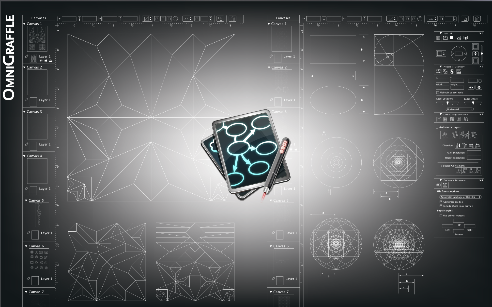

## Introduction
OmniFocus, a leading task management app, required a major update to address evolving user needs and maintain its competitive edge. As a key contributor to version 3, I worked closely with the CEO and product manager to define the scope of the release.

Our goal was to enhance the product based on user feedback—such as the need for more flexible tagging and improved calendar integration—and to ensure an enhanced user experience across Mac and iOS platforms. We gathered user insights through interviews, surveys, and usability testing, ensuring our design addressed real user needs and pain points.

<figure>
  

<figcaption>OmniWeb.</figcaption>
</figure>

<figure>
  

<figcaption>OmniWeb.</figcaption>
</figure>

<figure>
  

<figcaption>OmniGraffle.</figcaption>
</figure>

<figure>
  

<figcaption>OmniWeb.</figcaption>
</figure>